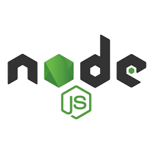
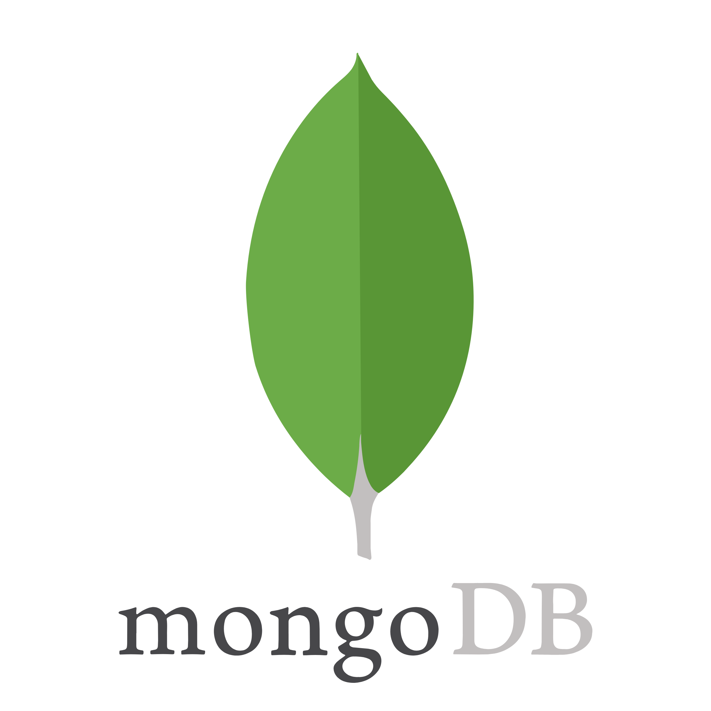
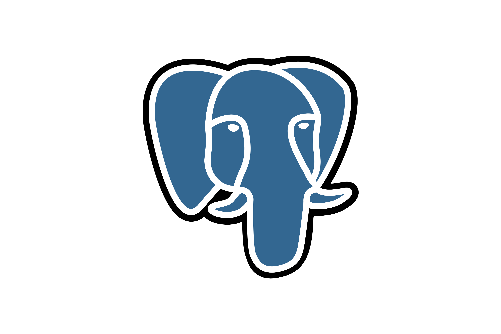
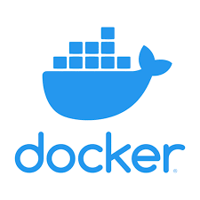
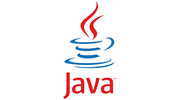

# Hi, I'm Ayush 👋

Backend Developer | Open Source Learner | Backend Enthusiast

I build backend systems, learn by shipping small projects, and keep improving my fundamentals in databases, distributed systems, and software design.

## Tech Stack

	
	
	
	
	

## Currently Learning

- System Design
- Data Structures and Algorithms
- Artificial Intelligence

## Open Source Projects

- Authentication Roadmap
- MongoDB Learning Path
- PostgreSQL Learning Path

## Contact

	
	

## What Would Make This Stronger

- Add one-line descriptions for each project.
- Link every project and contact item.
- Include a short "Goals" or "Currently building" section.
- Add GitHub stats or contribution highlights if you want a more visual profile.