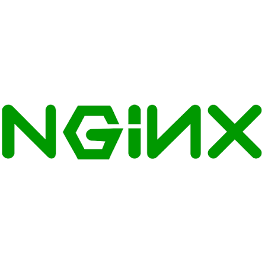

# Hi, I'm Ayush 

Backend Developer | Open Source Learner | Backend Enthusiast

I build backend systems, learn by shipping small projects, and keep improving my fundamentals in databases, distributed systems, and software design.

## Tech Stack

	
	
	
	
	
	
	
	
	
	
	

## Currently Learning

- System Design
- Data Structures and Algorithms
- Artificial Intelligence

## Open Source Projects

- Authentication Roadmap
- MongoDB Learning Path
- PostgreSQL Learning Path

## Contact

	
	

Feel free to connect with me on LinkedIn or drop me an email if you want to collaborate on a project, discuss backend development, or just say hi!
